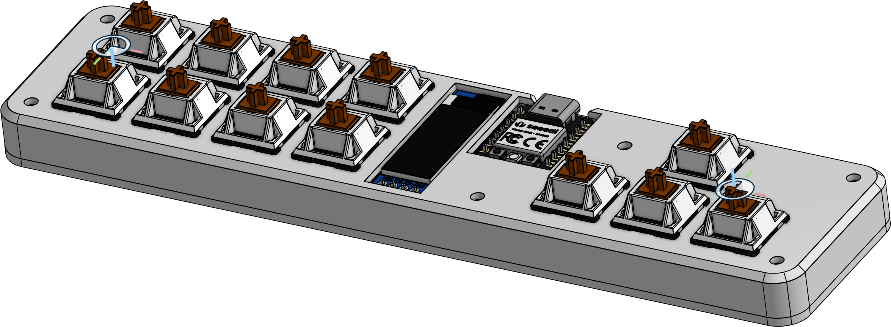

# Celestepad

A custom keypad made for Celeste with KiCad, OnShape and QMK.

# Index
I split this up into multiple readmes for simplicity. Feel free to look around the repo or just use this index:
 - [Assembly Guide](/assembly/README.md)
 - [KiCAD Readme](/kicad/README.md)
 - [QMK Readme](/qmk/readme.md)
 - [CAD Readme](/step/README.md)

# Attribution

I used some of the code in [nwii/oledbongocat](https://github.com/nwii/oledbongocat) for my firmware.