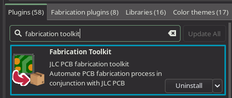

# KiCAD

This project was made with KiCad 9.
If any 3D models don't show up, check the individual symbols, maybe they should be cached? I'm not that familiar with KiCad so IDK.

# Ordering the PCB
I recommend using the fabrication toolkit plugin to generate the gerber files. You can find it in the KiCad Plugin and Content manager.

 

As for where to order, I recommend [JLCPCB](https://jlcpcb.com).  
This board doesn't require any special settings, just upload the gerber and let it figure it out for you. (For reference, the board dimensions are 185mm*40mm).